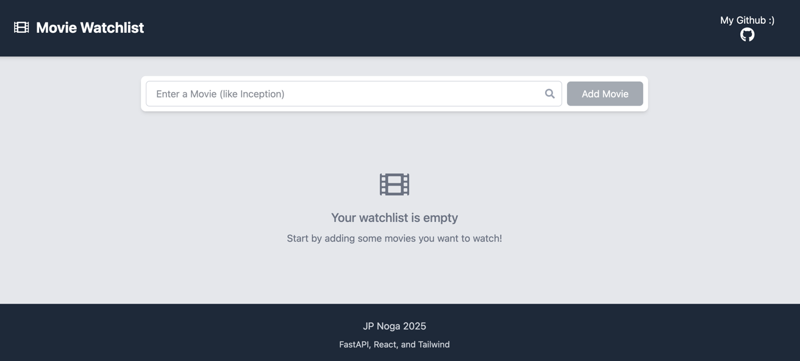
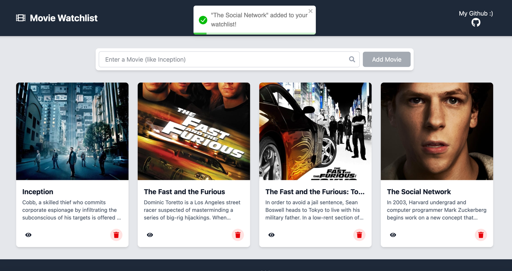

<h1 style="line-height: 90%;">Topics in CS: Midterm Project </h1>
<h3 style="line-height: 10%;"> Spring 2025 </h3>
 
<h1 style="line-height: 100%;"> Movie Watchlist Project</h1>
<h3 style="line-height: 100%;"> FastAPI, React, Vite, and Tailwind</h3>

## Frontend (React+Vite w/ Tailwind)
#### Aiming for speed here, I chose a frontend stack that would allow me to dynamically update the content of the [MovieCard.jsx](src/components/MovieCard.jsx) that are added into the [MovieList.jsx](src/components/MovieList.jsx) using the [MovieForm.jsx](src/components/MovieForm.jsx). All of these are components that I put together with React that interacts with the FastAPI backend.

### API Microservice handles taking information from the frontend and transacting it with FastAPI

## Backend (FastAPI + TMDB API)
#### Not only do I integrate API functionality between the back and frontend, in order to get the movies in the search bar I used the open source TMDB API. This requires a custom API key to function properly which *I have removed from this GitHub and must be added in to work properly*.

## Screenshots
### Site with no movies

### Site with movies added
