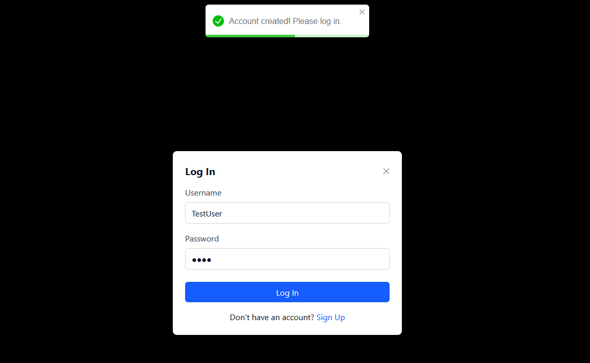

<h1 style="line-height: 90%;">Topics in CS: Midterm Project (Part 2) </h1>
<h3 style="line-height: 10%;"> Spring 2025 </h3>
 
<h1 style="line-height: 100%;"> Movie Watchlist Project (Part 2) </h1>
<h3 style="line-height: 100%;"> FastAPI, React, Vite, and Tailwind (Now with MongoDB)</h3>

## ***User Account Update (April 2025)
### Per requirements, I added a user account system that allows users to create and sign in and out of accounts that are stored in the MongoDB database. This allows users to have their own separate watchlist that is retained in MongoDB.
### This is a screenshot with the user Snow logged in and the watchlist populated with a movie.

### This is a screenshot with the user Thing logged in and the watchlist populated with a different movie.

### At the bottom are screenshots of the login and signup pages.

## Frontend (React+Vite w/ Tailwind)
#### Aiming for speed here, I chose a frontend stack that would allow me to dynamically update the content of the [MovieCard.jsx](src/components/MovieCard.jsx) that are added into the [MovieList.jsx](src/components/MovieList.jsx) using the [MovieForm.jsx](src/components/MovieForm.jsx). All of these are components that I put together with React that interacts with the FastAPI backend.

### API Microservice handles taking information from the frontend and transacting it with FastAPI. FastAPI then takes the information and stores it in the MongoDB database.

## Backend (FastAPI + TMDB API + MongoDB)
#### Not only do I integrate API functionality between the back and frontend, in order to get the movies in the search bar I used the open source TMDB API. This requires a custom API key to function properly which *I have added to the Github, disregarding by request, any recommended security practice*. 

## Screenshots
### Login and Signup 

### Test user in the MongoDB database
